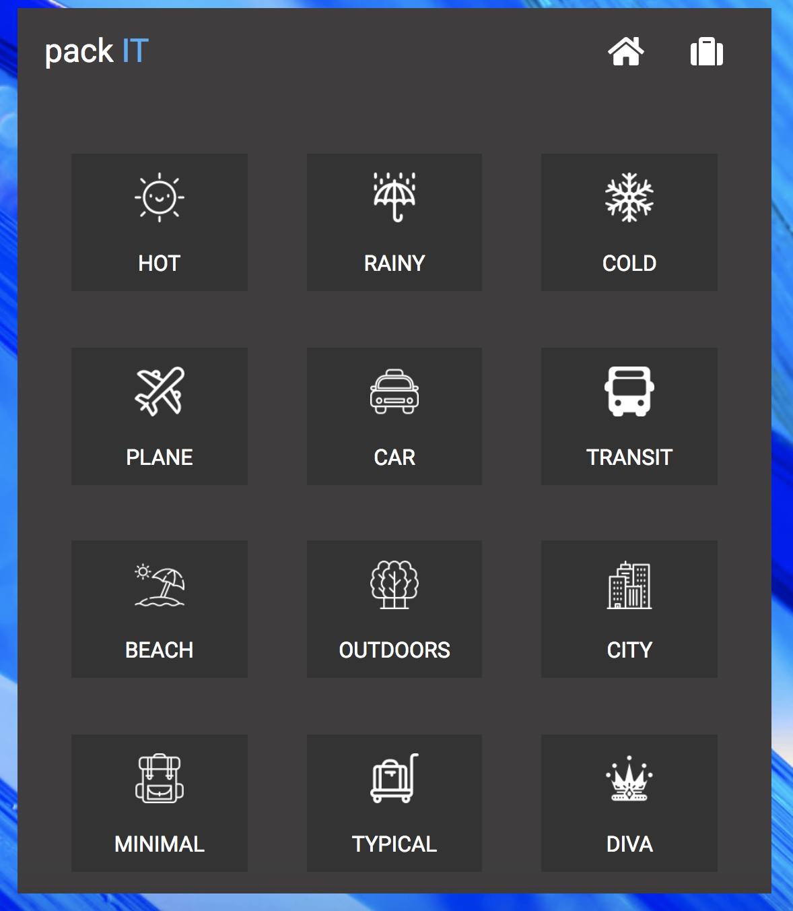
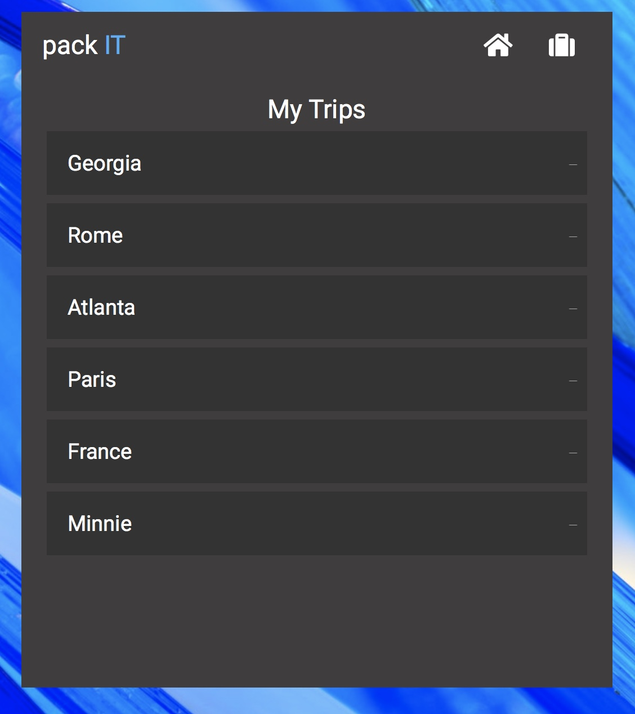
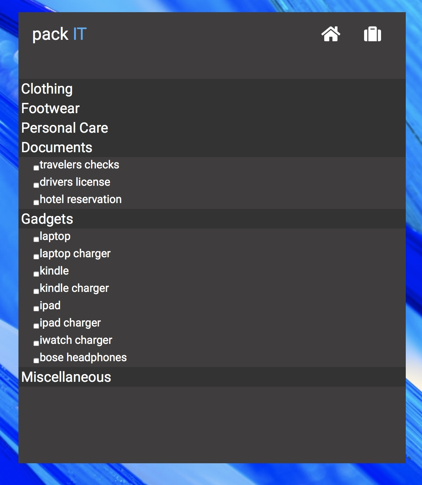

# packIT - A packing companion for busy travelers
This is a group project for a Full Stack Web Development Bootcamp. 

The `packIT` application is the perfect companion for travelers who need a simplified approach to packing.  Users select four attributes:
    * Weather:  Hot, Rainy, Cold
    * Transportation: Plane, Car, Transit
    * Destination: Beach, Outdoor, City
    * Packing Style: Minimal, Typical, Diva

The combination selected provides users with a pre-compiled packing list to eliminate guess work and expidite packing.  Users also have the ability to customize their list by adding and deleting items.

A secure log-in provides users with the ability to store and access their lists per trip type.   

The attached images illustrate a homescreen and sample packing list combinations: 

# Testing
The following applications need to be installed to verify testing for both front-end and back-end files.
- Mocha
- Chai

# Dependencies
The following applications need to be installed in order to run the `packIT` app.
- Node.js
- Express
- Mongoose

# Getting Started
To start this project clone a copy of the project repository from Github onto your machine.  Once the repository is cloned run `npm install` which is needed to run the app.  Then install the additional Node packages below: 

- npm:
    * express
    * mongoose
    * mongoose-unique-validator
    * crypto
    * jsonwebtoken
    * dotenv

Once completed run `node server.js` or `nodemon server.js`.

# Deployment
The project is deployed with Heroku.
- Heroku add-ons:  mLab MongoDB

# Code Structure
Models
- index.js
- item-schema.js
- trips-schema.js
- user-schema.js

Public Files
- assets
    * 12 png files in white
    * 12 png files in blue
- images
- js
    * compiled.js
    * customizedList.js
    * login.js
- styles
    * reset.css
    * style.css
- test-frontend
    * test-compiledF.js
    * test-customF.js
    * test-loginF.js
    * test.html
- index.html

Routes
- api-routes-item.js
- api-routes-trips.js
- api-routes-user.js
- html-routes.js

Test Backend
- test-item.js
- test-trips.js
- test-user.js

Other
- server.js
- node_modules
- .gitignore
- package-lock.json
- package.json
- README_projectInstructions
- README.md:  Project Overview

# Authors
- Robert Doughty - Login, Saving User Trip Profiles
- Pawan Jada - Customization / Adding & Deleting Packing List Items
- Juliana Tyler - Pre-compiled Packing List
- Kyla Middleton - Lead Architect
    * Created base HTML and CSS
    * Configured models and api routes.
    * Completed all back-end testing
    * Seeded and audited database. 

# Acknowledgements
- Unsplash Photos
    * Photo by Martin Login on Unsplash (https://unsplash.com/photos/A33S9-Ih0qQ)

- Icons
    * Icon made by [https://www.freepik.com/] from [www.flaticon.com] which is licensed by Creative Commons BY 3.0 [http://creativecommons.org/licenses/by/3.0/].